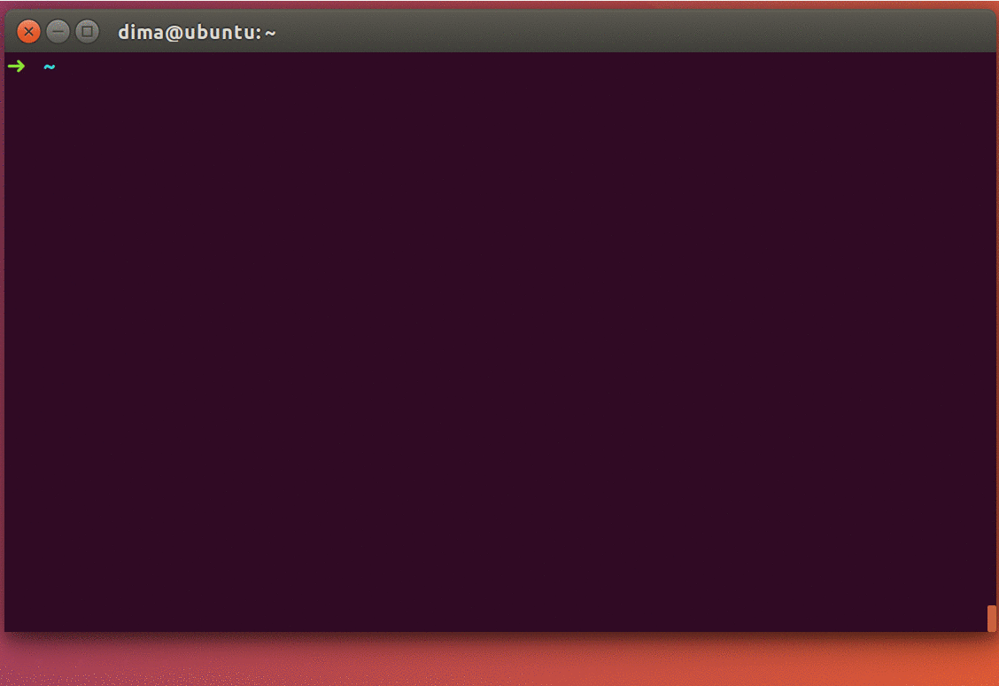

---


## <span style="color:red"> WARNING! </span>

<span style="color:red">

**This tool is in beta and we're working to improve it.
Feedback is greatly appreciated, but please use at your own risk.**

</span>

---

## SSH Guardian Agent

Traditional ssh-agent forwarding
[can](https://heipei.github.io/2015/02/26/SSH-Agent-Forwarding-considered-harmful/)
[be](https://news.ycombinator.com/item?id=9425805)
[dangerous](https://lyte.id.au/2012/03/19/ssh-agent-forwarding-is-a-bug/): the
local ssh-agent hast to sign opaque challenges using the user's private key,
without knowing (a) what intermediary host is asking for the signature, (b) what
remote server that intermediary host wants to authenticate to, or (c) what
command the intermediary host wants to execute on the remote server. 

A compromised intermediary can send rogue challenges and use the user's identity
to authenticate to other servers or to run unauthorized commands. So you might
enable ssh-agent forwarding and be asked yes or no on signing "something," and
you think it's allowing an EC2 machine to run "git push" to GitHub. But actually
it's allowing a different EC2 machine (that you also are logged in to) to
connect to some other sensitive server that you have permissions on and add an
evil key to your authorized_keys file.)

SSH Guardian Agent provides secure SSH agent forwarding. A user first runs
`sga-guard` on her local machine (on which she stores her private SSH keys) to
securely forward her SSH agent to an intermediary machine (e.g., on AWS). She
can then use `sga-run` on the intermediary machine to establish SSH connections
to other servers. The local `sga-guard` verifies the identity of the
**intermediary**, the **remote server** and the **command**, either by prompting
the user or based on a stored security policy.



* [Installation](#installation)
* [Basic Usage](#basic-usage)
* [Advanced Usage](#advanced-usage)
  * [Prompt types](#prompt-types)
  * [Customizing the SSH command](#customizing-the-ssh-command)
  * [Stub location](#stub-location)
* [Building from Source](#building-from-source)
* [Troubleshooting](#troubleshooting)
* [Development](#development)


## Installation
Using SSH Guardian Agent requires installation both on your local machine (the
one with your SSH private keys) and on each of the intermediary machines you
want to securely forward SSH agent to (the machines on which you want to run an
SSH client without having the keys on them). **No installation is required on the
server side.**

1. Install the following dependencies:
  * OpenSSH client
  * [autossh](https://linux.die.net/man/1/autossh)
  * ssh-askpass (MacOS users can use the [following port](https://github.com/theseal/ssh-askpass))
2. Obtain the [latest
   release](https://github.com/StanfordSNR/guardian-agent/releases/latest) for
   your platform. Alternatively, you may opt to [build from source](#building).
3. Extract the binaries (`sga-guard`, `sga-guard-bin`, `sga-run`, and
   `sga-stub`) from the tarball to a directory in the user's PATH.

## Basic Usage

Make sure SSH guardian agent is installed on both your local and intermediary machine.

### On your local machine
Start guarded SSH agent forwarding to the intermediary machine:

```
[local]$ sga-guard <intermediary>
```  

You should then expect to see the following message:
```
[local]$ sga-guard <intermediary>
Listening for incoming Guardian Agent requests from aws-ubu...
```

Guarded agent forwarding is now enabled on the intermediary.

### On the intermediary
Connect to the intermediary (e.g., using standard ssh or mosh). 
You can then use `sga-run` as a drop-in replacement to an ssh client (albeit supporting only limited command-line options).

Then run the following from any terminal session on the intermediary:
```
[intermediary]$ sga-run <server> [command]
```

This should trigger a local graphical consent prompt explicitly identifying
`intermediary`, `server` and `command`.

### Common use cases
To use `sga-run` as a drop-in replacement for `ssh` on the intermediary host, add these lines to your `~/.bashrc` file (on the intermediary):

```
alias sga-scp="scp -S sga-run"
alias sga-rsync="RSYNC_RSH=sga-run rsync"
alias sga-git="GIT_SSH_COMMAND=sga-run git" 
alias sga-mosh="mosh --ssh=sga-run"
```

## Advanced Usage

### Prompt types

Guardian agent supports two types of interactive prompts: graphical and
terminal-based. The graphical prompt requires the `DISPLAY` environment variable
to be set to the appropriate X11 server.  
If running in a terminal-only session (in which the `DISPLAY` environment
variable is not set), a textual prompt will be used instead.

### Customizing the SSH command

When using `sga-guard`, the default SSH client on the local machine is used to
set up the connection. This requires `ssh` to be found in the user's `PATH`. To
specify an alternative SSH client or specifying additional argument to the
client, use the `--ssh` command-line flag.

### Stub location

If the `sga-stub` is not installed in the user's `PATH` on the intermediary
machine, its location must be specified when setting up secure agent forwarding
from the local machine:

```
[local]$ sga-guard --stub=<PATH-TO-STUB> <intermediary>
```
## Building from Source
1. [Install go](https://golang.org/doc/install)
2. Get and build the sources:
```
go get github.com/StanfordSNR/guardian-agent/...
```
3. Copy the built binaries (`sga-guard-bin`, `sga-run`, and `sga-stub`) from `$GOPATH/bin` to a directory in the user's PATH.
4. Copy the script `$GOPATH/StanfordSNR/guardian-agent/scripts/sga-guard` to a directory in the user's PATH.

## Troubleshooting

In case of [unexpected behavior](https://en.wikipedia.org/wiki/Bug_(software)), please consider opening an issue in our [issue tracker](https://github.com/StanfordSNR/guardian-agent/issues).
We'd also greatly appreciate if you could run the tool in debug mode by setting the `--debug` and `--logfile=<LOG-FILE>` flags and attach the log file to the issue.

## Development
[Detailed Design](doc/design.md)
