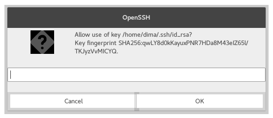
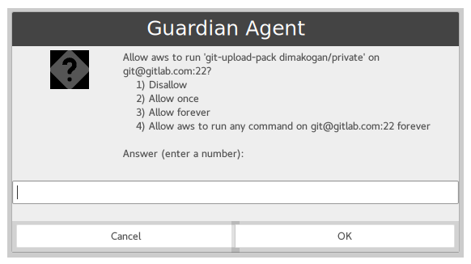
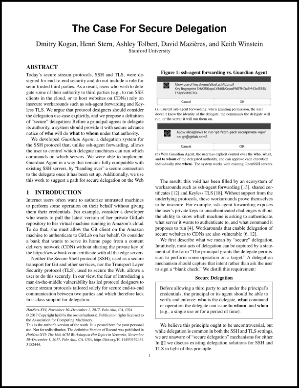
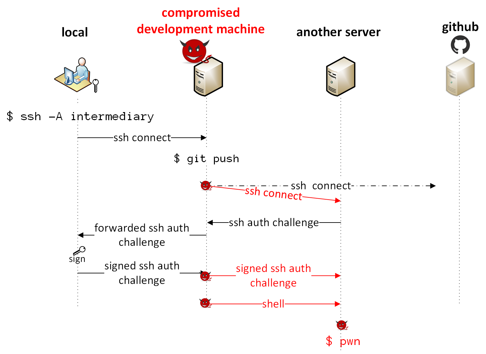

## Guardian Agent: secure agent forwarding for Mosh or SSH

Guardian Agent (now in beta) allows users to **securely** empower
remote hosts to take actions on their behalf, using their SSH
credentials. It allows Mosh and SSH users to enable agent forwarding
for every connection, even to hosts they may not fully trust.

Guardian Agent is an alternative to traditional `ssh-agent`
forwarding, which can only safely be enabled when connecting to
trusted hosts. The traditional `ssh-agent` protocol doesn't give
the agent information about which host is asking to perform a command
on the user's behalf, which server that hosts wants to connect to,
or which command the host wants to perform:



By contrast,
Guardian Agent provides secure `ssh-agent` forwarding and can be used
alongside Mosh or SSH. A user runs
`sga-guard` on her local machine (on which she stores her private SSH keys) to
securely forward her `ssh-agent` to an intermediary machine (e.g., on AWS). She
can then use `sga-ssh` on the intermediary machine as a drop-in replacement to
`ssh`. The local `sga-guard` verifies the identity of (a) the **intermediary** host, (b) the
**remote server**, and (c) the **command**[<sup>*</sup>](#command-verification),
either by prompting the user or based on a stored security policy.



## Research paper

Our paper will appear in <a href="https://conferences.sigcomm.org/hotnets/2017/program.html">HotNets 2017:</a>

<p align="center">
<a href="doc/hotnets17.pdf">

</a>
</p>


## <span style="color:red"> WARNING! </span>

<span style="color:red">

**This tool is in beta and we're working to improve it.
Feedback is greatly appreciated, but please use at your own risk.**

</span>

---

## Installation
Using Guardian Agent requires installation **both on your local machine** (the
one with your SSH private keys) and on each of the **intermediary machines** you
want to securely forward `ssh-agent` to (the machines on which you want to run an
SSH client without having the keys on them). **No installation is required on the
server side.**

<details><summary>Ubuntu installation</summary><p>

```
sudo apt-get install openssh-client autossh ssh-askpass
curl -L https://api.github.com/repos/StanfordSNR/guardian-agent/releases/latest | grep browser_download_url | grep 'linux' | cut -d'"' -f 4 | xargs curl -Ls | tar xzv
sudo cp sga_linux_amd64/* /usr/local/bin
```

</p>
</details>

<details><summary>macOS installation</summary><p>

```
brew install autossh ssh-askpass
curl -L https://api.github.com/repos/StanfordSNR/guardian-agent/releases/latest | grep browser_download_url | grep 'darwin' | cut -d'"' -f 4 | xargs curl -L | tar xzv
sudo cp sga_darwin_amd64/* /usr/local/bin
```

</p>
</details>
</p>
</details>
<details><summary>Other</summary><p>

1. Install the following dependencies: OpenSSH client, autossh, ssh-askpass.
2. Obtain the [latest
   release](https://github.com/StanfordSNR/guardian-agent/releases/latest) for
   your platform. Alternatively, you may opt to [build from source](#building-from-source).
3. Extract the executables (`sga-guard`, `sga-guard-bin`, `sga-ssh`, and
   `sga-stub`) from the tarball to a **directory in the user's PATH**.

</p>
</details>


## Basic Usage

Make sure SSH guardian agent is installed on both your local and intermediary machine.

### On your local machine
Start guarded SSH agent forwarding to the intermediary machine:

```
[local]$ sga-guard <intermediary>
```  

You should then expect to see the following message:
```
[local]$ sga-guard aws-ubu
Connecting to aws-ubu to set up forwarding...
Forwarding to aws-ubu setup successfully. Waiting for incoming requests...
```

Guarded agent forwarding is now enabled on the intermediary.

### On the intermediary
Connect to the intermediary (e.g., using standard ssh or mosh). 
[Install](#installation) guardian-agent.
To enable several common tools (scp, git, rsync, mosh) to use the guardian agent instead of the default
`ssh` program:
```
[intermediary]$ source sga-env.sh
```
You can also add this line to your `~/.bashrc`/`~.zshrc`/... file on the intermediary hosts.

You can then use `git`, `scp`, `rsync`, `mosh` as you would normally do.

```
[intermediary]$ git clone git@github.com:user/repo
...
[intermediary]$ scp foo.txt remote-host:Documents/foo.txt
...
```


You can also use `sga-ssh` as a drop-in replacement to an ssh client:

```
[intermediary]$ sga-ssh <server> [command]
```


## Advanced Usage

### Command verification

Command verification requires the server to support the `no-more-sessions`
extension. This is extension is present on OpenSSH servers, but
unfortunately not implemented on other SSH servers (including GitHub, which uses `libssh`). When
executing a command on a server that does not support this extension, only the
identity of the intermediary and the identity of the server can be constrained and verified by the agent
(but not the contents of the command).

### Prompt types

Guardian Agent supports two types of interactive prompts: graphical and
terminal-based. The graphical prompt requires the `DISPLAY` environment variable
to be set to the appropriate X11 server.  
If running in a terminal-only session (in which the `DISPLAY` environment
variable is not set), a textual prompt will be used instead.

### Customizing the SSH command

When using `sga-guard`, the default SSH client on the local machine is used to
set up the connection. This requires `ssh` to be found in the user's `PATH`. To
specify an alternative SSH client or specifying additional argument to the
client, use the `--ssh` command-line flag.

### Stub location

If the `sga-stub` is not installed in the user's `PATH` on the intermediary
machine, its location must be specified when setting up secure agent forwarding
from the local machine:

```
[local]$ sga-guard --stub=<PATH-TO-STUB> <intermediary>
```
## Building from Source
1. [Install go 1.8+](https://golang.org/doc/install)
2. Get and build the sources:
```
go get github.com/StanfordSNR/guardian-agent/...
```
3. Copy the built binaries (`sga-guard-bin`, `sga-ssh`, and `sga-stub`) from `$GOPATH/bin` to a directory in the user's PATH.
4. Copy the scripts `$GOPATH/src/github.com/StanfordSNR/guardian-agent/scripts/sga-guard` and `$GOPATH/src/github.com/StanfordSNR/guardian-agent/scripts/sga-env.sh` to a directory in the user's PATH.

## Troubleshooting

In case of [unexpected behavior](https://en.wikipedia.org/wiki/Bug_(software)), please consider opening an issue in our [issue tracker](https://github.com/StanfordSNR/guardian-agent/issues).
We'd also greatly appreciate if you could run the tool in debug mode by setting the `--debug` and `--logfile=<LOG-FILE>` flags and attach the log file to the issue.

## FAQ

Q: Is `ssh-agent` forwarding really insecure? What is the point of Guardian Agent?

A: The ssh(1) man page warns that "Agent forwarding should be enabled with caution," because
the `ssh-agent` cannot verify (a) which intermediary machine is making the request, (b)
which remote server the intermediary wants to authenticate to, or (c) what command the
intermediary plans to run on the remote server. The agent simply signs a blank check---
an opaque challenge from an unknown server that will allow the intermediary to execute
any sequence of commands on the user's behalf.

As a result, ssh-agent forwarding can only be used safely when the
user trusts the remote host.  Several
[commentators](https://heipei.github.io/2015/02/26/SSH-Agent-Forwarding-considered-harmful/)
[have](https://news.ycombinator.com/item?id=9425805)
[noted](https://lyte.id.au/2012/03/19/ssh-agent-forwarding-is-a-bug/)
that this creates risks that may not be widely appreciated.

Guardian Agent is a prototype of a system for secure agent forwarding
that could be enabled on **every** outgoing connection, because the local agent can
verify and enforce security policies regarding who wants to do what to whom.


A compromised or malevolent intermediary can send rogue challenges and
use the user's identity to authenticate to other servers or to run
unauthorized commands. So you might enable ssh-agent forwarding and be
asked yes or no on signing "something," and you think it's allowing an
EC2 machine to run "git push" to GitHub. But actually it's allowing a
different EC2 machine (that you also are logged in to) to connect to
some other sensitive server that you have permissions on and add an
evil key to your authorized_keys file.)

<p align="center">

</p>


Q: What if I only use `ssh-agent` forwarding when I SSH to intermediaries that I trust?

A: If the user trusts the software (and system administrator) on the
intermediary host, it is essentially fine to use ssh-agent forwarding
as it exists today. However, with this level of trust, it may also be
fine to simply place a private key on the intermediary's hard drive
and use that to authenticate to remote servers, rather than forwarding
agent requests back to the local agent.

Q: Can I use this to constrain an intermediary to only pull from (or only push to) a limited
set of remote Git repositories?

A: Yes, **if** the remote Git server is running an SSH server (such as OpenSSH) that supports `no-more-sessions` and allows Guardian Agent to limit
the command. (The name of the repository, and the difference between pulling and pushing,
are both represented in the command.) Among popular Git-hosting services that we
are aware of, currently only GitLab
appears to support this currently. GitHub and Bitbucket use other SSH implementations and
do not allow Guardian Agent to constrain the intermediary to only push or pull from certain
repositories.

Q: Is Guardian Agent secure?

A: Guardian Agent is a technology preview that was first released for beta testing in October 2017.
It has not accumulated enough testing and scrutiny to make claims that the implementation is
bulletproof.

Q: Why did you write Guardian Agent in Go?

A: Guardian Agent is a technology preview intended to solicit feedback from the community,
especially with regards to the basic design of a secure ssh-agent forwarding mechanism
that works with unmodified remote SSH servers. We found Go and the Go SSH library to be helpful
in rapidly prototyping this tool.

Q: What is the connection to Mosh (mobile shell)?

A: Many Mosh users have <a
href="https://github.com/mobile-shell/mosh/issues/120">asked for
ssh-agent forwarding support</a>. Guardian Agent was developed by some of the Mosh developers
and can be used with Mosh today. Based on feedback to this prototype, we may integrate Guardian
Agent more fully into Mosh as a system for secure ssh-agent forwarding that is safe enough
to leave on by default.

Q: Who wrote Guardian Agent?

A: Guardian Agent was developed by students and faculty in the
Stanford University Department of Computer Science (Dima Kogan and
Henri Stern, advised by Keith Winstein and David Mazières).

Q: Where should I send feedback?

A: Please file an issue on GitHub.

## Development
[Detailed Design](doc/design.md)
