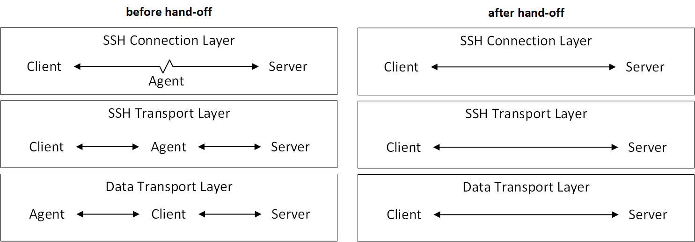

# Guardian Agent Design

## Overview
Guardian Agent allows an **SSH client**, running on a partially
trusted machine, to request the **SSH agent**, running on a trusted machine,
to execute commands on an **SSH server**, such that the identity of
the server as well as the SSH session command can be verified by the SSH agent,
with the server's own code unaltered.

At some point the client can choose to take over the connection by having the
agent hand it off.

Our system consists of a custom SSH client and an authentication agent.
Schematically, the client, who has no access to the user's secret credentials,
requests that the agent establish an SSH connection with a server using
credentials available only to the agent. The agent can then choose to allow or
block this delegation subject to a security policy it enforces. The policy may
be based on the identity of the client, the identity of the server, and the
requested commands. If the agent chooses to allow the operation, it will
establish a connection to the server using its credentials. The client then uses
this connection to execute commands on the server. The client may then retrieve
appropriate data from the server by requesting that the agent hand the
connection with the server off to it. The agent may choose to do so or not
depending on whether the connection has been restricted from executing
additional commands, using the `no-more-sessions` request. Thereafter the
data transfer to and from the server is done directly by the client. 

A key property of our system is that requires no changes whatsoever to the
server, and can be used as a drop-in replacement for existing SSH clients
and SSH agents. This carries the practical advantage of providing users with
immediate security benefits without being dependent on any changes being made by
the various SSH serves with which they already interact. 

## Technical Background

The [SSH protocol](https://tools.ietf.org/html/rfc4251) consists of three major
components: The [(SSH) transport layer
protocol](https://tools.ietf.org/html/rfc4253) provides encryption, integrity,
and server authentication. The [user authentication
protocol](https://tools.ietf.org/html/rfc4252) authenticates the client-side to
the server. The [connection protocol](https://tools.ietf.org/html/rfc4254)
multiplexes the encrypted tunnel into several logical channels to be used as
part of the higher-level services SSH provides such as remote command execution.

The **SSH transport layer protocol** is the lowest-level component, which
typically runs on top of TCP/IP. The protocol provides higher-level components
with an encrypted connection that guarantees data integrity, as well as
authenticates the server to the client. The connection setup consists of the
following main steps:
1. Each party sends a protocol and version identification string.
1. The parties negotiate the cryptographic suite of algorithm they shall use.
    Each party sends an `SSH_MSG_KEXINIT` packet, which includes a random nonce
    as well as the server host key and the lists of algorithms the party
    supports for key exchange, encryption, and message authentication. For each
    of these purposes, the first algorithm on the client's list that is also on
    the server's list is chosen.  
1. The parties engage in key exchange according to the specifics of the chosen
    algorithm. The output of the exchange is a shared secret key `K` and an
    exchange hash `H` computed on the transcript of the negotiation messages.
    The shared secret key is used to derive actual encryption and authentication
    keys. The exchange hash is also used as the permanent session identifier
    throughout the connection.
1. The server proves his identity to the client by signing the exchange hash `H`
    with his private key, and the client verifies this signature using the
    public key he associates with the server's identity.
1. The exchange ends by each side sending an `SSH_MSG_NEWKEYS` packet, the
    signal that both should now be using the new keys and algorithms.

Data integrity is protected by including a MAC with each packet. The MAC is computed
from the shared secret key, packet sequence number, and the contents of the
packet.

One additional feature supported by the SSH transport layer protocol is **key
re-exchange**, which either party can initiate at any time during the connection
by sending a new `SSH_MSG_KEXINIT` packet. Many SSH implementations make use of
this feature after 1GB of data has been sent on the transport layer, or some
amount of time has passed. The re-exchange is processed identically to the
initial key-exchange, and allows changing all algorithms and keys. Furthermore,
all encryption and compression contexts are reset after a key re-exchange. The
session identifier remains unchanged throughout the connection. The packets of
the key re-exchange itself are protected by the previously negotiated encryption
and message authentication keys, until an `SSH_MSG_NEWKEYS` packet
brings the new keys into effect. 

The **SSH authentication protocol** runs on top of the SSH transport layer
protocol, and its goal is to authenticate the user to the server. Multiple
authentication methods are supported, including password and public key. Regardless
of the chosen authentication method, the client proves its identity by providing its
credentials in conjunction with the Session ID established by the transport protocol,
as described above.

The **SSH connection protocol** provides higher level services such as
interactive shells, execution of remote commands, forwarded TCP/IP connections
and UNIX domain sockets, etc. These are all implemented as independent flow-
controlled channels, which the connection protocol multiplexes over the
encrypted tunnel established by the transport protocol. Within the context of
this protocol, a **session** is a remote execution of a program, which may be
a shell or an application. A session is started by the client sending a 
`SSH_MSG_CHANNEL_OPEN` message with the channel type field set to 
`"session"`, and subsequently sending a `SSH_MSG_CHANNEL_REQUEST`
message which specifies the command (or shell) to be executed.

The popular OpenSSH implementation
    [provides](https://raw.githubusercontent.com/openssh/openssh-portable/master/PROTOCOL)
    a useful extension to the SSH connection protocol in the form of a
    `no-more-sessions` global request. On receipt of this request, an OpenSSH
    server will refuse to open future sessions, effectively "locking" the
    connection to the commands that have already been executed. This request is
    simply ignored by servers whose SSH implementation does not recognize it.

## System Architecture
Our system consists of a custom SSH client and an authentication agent. For
instance, the client might be an untrusted third-party machine running in the
cloud, with the agent running on a user's trusted machine.
The design of our system is best described in terms of each of the layers in the
SSH architecture. 

### Control Layer
The bottom-most layer of our protocol is a control
layer used for direct negotiation between the client and the agent. This layer
is established on top of an underlying transport between the client and the
agent, which provides reliability, confidentiality, message integrity, and
mutual authentication. An example to such a transport is a UNIX domain socket
forwarded on top of an SSH connection between the agent and the client (and we
discuss it in more detail in the implementation section).

When the client connects to the agent, it first sends a 
`CONNECTION_REQUEST` message, which includes the host and port of the
server, the requested command, as well as the username to be used for the
connection to the server. These are preliminary verified against the security
policy of the agent. If the request is approved by the policy, the agent
responds with a `CONNECTION_APPROVED` message and proceeds with the
session. If the request is blocked by the policy, the agent responds with a 
`CONNECTION_DENIED` message and terminates the connection.

### Data Transport Layer
From the perspective of the server, this connection must take place over a
single uninterrupted TCP/IP connection, as it is unaware of any changes in the
state of the SSH connection (before and after the hand-off).
Moreover, since the agent may not necessarily have TCP/IP
connectivity with the server (e.g., if the server is in the same internal
network as the client, yet is unreachable from the agent), the TCP/IP connection
between the agent and the server (over which the SSH connection is established)
is formed over a tunnel provided by the client. Throughout this paper we refer
to this layer as the **data transport layer** (to distinguish it from the
**SSH transport layer**).

More specifically, when the client connects to the agent, it also creates a 
data transport layer connection with the server, yet it does not initiate an SSH 
connection on top of it. Instead, the client forwards this connection with the 
server to the agent, by means of encapsulating the connection's packets in messages
that are sent to the agent. Likewise, in the other direction, the agent will forward
its messages to the server through the client. After the SSH connection is
handed-off to the client, the client continues to use the same data transport
to the server, but has taken control of the SSH packets sent through it. In operating
thus, the hand-off is transparent to the data transport layer on the server.

### SSH Transport Layer
To enforce the security policy, the agent must remain in control of the SSH
connection until (if ever) it is safe to hand it off to the client. To this end,
in his connection to the server, the agent acts as a standard SSH client. As
such, he has for example the liberty to use an algorithm suite of his choice,
and to choose the client-side random nonce and the key shares for the key
exchange. The SSH transport layer is thus established end-to-end between the
agent and the server, and provides the agent with the benefits of message
integrity, confidentiality and verification of the identity of the server.
Following the establishment of the connection, the agent then authenticates to
the user using the credentials available to him. Overall, even though the SSH
connection is tunneled on the data transport layer through the client, the
connection, and in particular the user's credentials, are secure against both
passive and active attacks by the client.

Our design strives to make the presence of the agent as transparent as possible
to the client, which subsequently allows making only a handful of changes to the
client's implementation of the SSH transport layer protocol and, as we describe
below, requires practically no changes to the implementation of the higher level
SSH connection protocol. To this end, when the client connects to the agent, he
and the agent establish an SSH transport layer connection between themselves,
with the client in the role of a client, and the agent in the role of a server.
On the client side, this connection can be leveraged to run unmodified
implementations of the higher layers of the SSH protocol stack, such as the SSH
connection protocol. On the agent side, the two transport connections (one with
the client, in which he plays the role of a server, and the one with server, in
which he plays the role of a client) are "bridged" to each other, subject to a
stateful filter, which enforces the security policy (blocking, for example,
unauthorized commands). Note that at this point, the transports are completely
independent, have different encryption and MAC keys, different session
identifiers and possibly even use different algorithm suites.

### Transport Handoff
 When, subject to policy approval, a hand-off is to take place, the two
transport connections needs to be transformed to a single end-to-end transport
between the client and the server. A naive way to perform such a hand-off
would have consisted of capturing the full state of the transport layer on the
agent, transferring it to the client, and restoring it there. The state that
need have been transferred includes, in particular, the choice of the
cryptographic algorithm suite, as well as the precise state of each of the
ciphers and MACs used. The state of each of them is very much cipher-specific
and could even depend on the particular implementation of the cipher. This
naive hand-off would have therefore had to be explicitly supported and
implemented by each present and future cipher, and would have also created an
unnecessary coupling between the cipher suite used by the client and the one
used by the agent.  

Instead, we exploit the fact that the SSH transport layer protocol supports key
re-exchange, which is almost identical to the initial key exchange, to provide
what we believe is a much more elegant solution: When the client wishes to
initiate a hand-off of the connection from the agent to himself, he initiates a
key re-exchange over the transport he shares with the agent by sending the
standard `SSH_MSG_KEXINIT` packet. Pending security policy approval,
the agent then forwards this packet to the other transport, as he does with the
following packets in both directions, effectively enabling a key exchange to
take place **directly** between the client and the server. This key-exchange
allows the client and the server to negotiate a cipher suite which is not
coupled to the algorithms supported by the agent, and moreover leads to a
synchronized state without requiring specialized support by the cipher
implementations. Before a `SSH_MSG_NEWKEYS` packet is sent in each
direction, all packets need to use the previously negotiated algorithms and
keys, yet this is trivially handled by the agent. When key re-exchange is
completed, the agent completes the hand-off by sending to the client a 
`HANDOFF_COMPLETE` control packet, which includes the parts of the
transport that need to be synchronized explicitly: the sequence number in each
direction and the session identifier. The client applies these parameters after
sending the `SSH_MSG_NEWKEYS` packet, and subsequent packets can be
sent **directly** to the server. At this point the client can disconnect from
the agent.

Note that another property of our hand-off method is that the new encryption
keys are never revealed to the agent. In some settings, this security benefit
could be meaningful, such as in cases where the agent needs to audit the command
itself, but the actual data sent from/to the remote command must remain private
to the client and the server.

### SSH Connection Layer 
As mentioned above, the connection layer requires minimal adaptation. From the
client's perspective, this layer behaves as if the client were connected
directly to the server. Since the entire state is maintained by the client, the
hand-off is completely transparent: There is no need to transfer any state such
as channel numbers, flow control windows, etc.

From the agent's perspective, this layer is used to implement the security
policy. The agent can restrict the type of channels that the client may open and
the commands that the client may execute on the server. Additionally, the agent
may enforce the conditions for a safe hand-off. For example, to guarantee that
the client does not execute additional commands on the server following the
hand-off, the agent must ensure that the hand-off only takes place after a
`no-more-sessions` request has been sent to and acknowledged by the server.

The connectivity in each of the protocol layers is summarized in the following
figure.

### Client Authentication
 As mentioned above, our protocol assumes that authentication of the client to
the agent is performed out-of-band. This is most suited for cases where the
agent and the client already share a mutually authenticated connection. A common
example for this is the setting in which the user forwards his locally listening
agent over an SSH connection to some remote machine. In this case, the identity
of the client in the eye of the agent is derived from the identity of the remote
machine in the underlying SSH connection (and consists at the very least of the
remote machine's public key, the hostname attached to it and the username used
on the remote machine). The main advantage of this method is that it does not
require a public key pair to be associated with the client (note that the client
does not necessarily have access to the private key of the **machine** on
which it is running).
